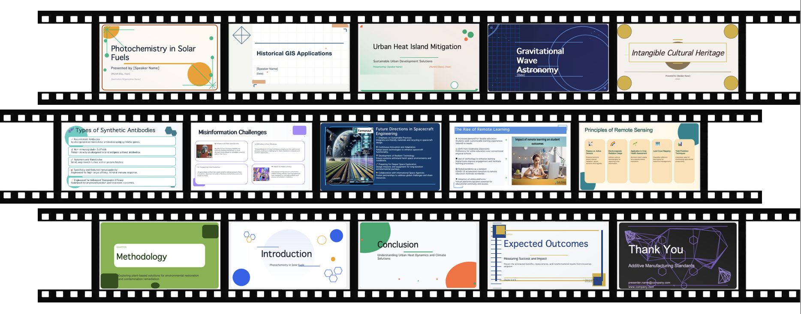
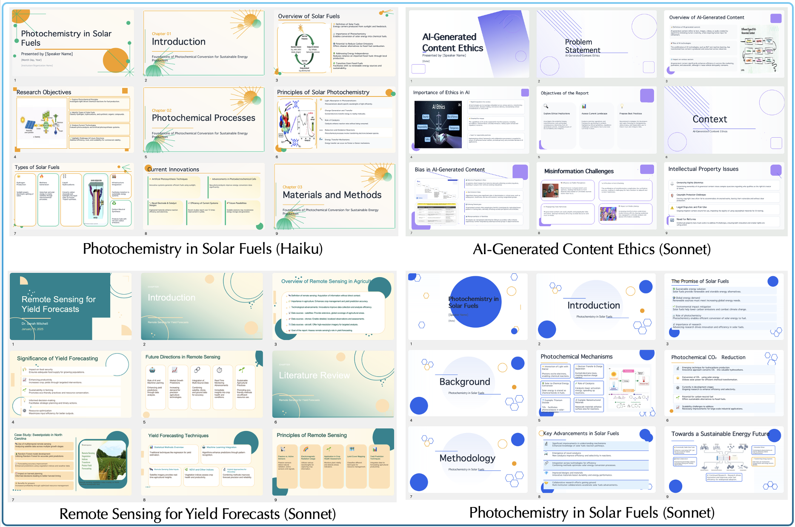

<div align="center">

# Design First, Code Later
### Aesthetically Pleasing Template-Free Slides Generation

[](paper.pdf)
[](LICENSE)
[](https://www.python.org/)
[](paper.pdf)
[](README_zh.md)

<br/>

*A hierarchical, design-first framework that decouples slide-level style design from page-level code implementation — no templates required.*

<br/>



</div>

---

## Highlights

| | |
|:---:|:---|
| 🏆 | **76.5%** Top-1 human preference vs all open-source baselines — exceeding the second-best (9.5%) by **68.0 pp** |
| 🏆 | **52.0%** win rate vs commercial systems (Kimi, Manus) — exceeding the second-best (19.5%) by **32.5 pp** |
| 📊 | Highest VLM-judge average score **3.78** across Layout, Hierarchy, Color, Clarity, and Coherence |
| 🎨 | Human eval: Clarity & Structure **4.25–4.29** · Visual Design & Aesthetics **3.84–3.98** |

---

## Comparison with Existing Methods

| Method | Output | Full Deck | Template-Free |
|:---|:---:|:---:|:---:|
| EvoPresent | HTML | ✅ | ❌ |
| AutoSlides | LaTeX/PDF | ✅ | ❌ |
| SlideGen / SlideCoder | PPTX | ❌ | ❌ |
| Kimi | PPTX/PDF | ✅ | ✅ |
| Manus | PPTX/PDF | ✅ | ✅ |
| **DeepSlides (ours)** | **PPTX/Image** | ✅ | ✅ |

---

## How it works

DeepSlides operates at two levels:

**Slides-level Design** — determines the global visual identity of the entire deck: tone, color palette, font colors, decorative shapes, and layout diversity guidelines. Pages are categorized into *functional pages* (cover, section dividers, end page) and *content pages*, each receiving tailored style instructions.

**Page-level Generation** — each slide is generated through four stages:

```
Content Expansion  →  Design  →  Implementation  →  Evaluation & Refinement
  (web search)       (3-layer)    (Python/PPTX)     (completeness · compliance · aesthetics)
```

The three design layers per slide:
- **Background layer** — textures, decorative elements, patterns
- **Layout layer** — block arrangement, spatial positions, structural boundaries
- **Content layer** — exact text snippets, images, visual elements

The full pipeline in `graph.py`:

```
Input (topic / image / style)
  │
  ├─[Image Analysis]          optional: infer research intent from a figure
  │
  ├─[Report Planning]         outline sections and search queries
  │
  ├─[Research & Writing]      parallel web search + writing per section
  │
  ├─[Slides-level Design]     global style, colors, shapes, tone
  │
  ├─[Cover / Chapter / End]   functional pages with matched styling
  │
  └─[Page-level Generation]   parallel per slide:
        expand → design (3 layers) → code → evaluate → refine
                                                            │
                                                            ▼
                                               presentation.pptx
```

---

## Key Features

- **Template-free** — each slide's layout is designed from scratch to match its content, preventing visual fatigue across the deck
- **Design–implementation decoupling** — a *designer* module reasons in a semantic design space; a *coder* module translates specs into stable PPTX code, limiting error propagation
- **Deep research integration** — built on [Open Deep Research](https://github.com/langchain-ai/open_deep_research), automatically retrieves web content, images, and academic sources per slide
- **Three-dimension evaluation** — each slide is scored on *completeness*, *compliance*, and *aesthetics*; low-scoring slides are iteratively refined before assembly
- **Multi-model support** — planner, writer, designer, and coder roles each use a configurable LLM (OpenAI, Azure, Anthropic Claude, or any OpenAI-compatible endpoint)
- **Multi-search backend** — Tavily · Perplexity · Exa · DuckDuckGo · arXiv · PubMed · Google Search · LinkUp
- **Image input** — provide a figure or screenshot; a vision model infers the research direction automatically
- **Parallel execution** — slides within a section are generated concurrently via LangGraph's `Send()` API

---

## Example Outputs



---

## Key Files

| File | Purpose |
|:---|:---|
| `src/open_deep_research/graph.py` | Main workflow graph (all nodes and edges) |
| `src/open_deep_research/configuration.py` | All configurable parameters and defaults |
| `src/open_deep_research/prompts.py` | Prompt templates for every stage |
| `src/open_deep_research/state.py` | TypedDict / Pydantic state schemas |
| `src/open_deep_research/utils.py` | Search backends, image captioning helpers |
| `src/open_deep_research/run.py` | Batch runner (CSV input) |

---

## Quick Start

### 1. Clone and install

```bash
git clone https://github.com/sxswz213/DeepSlides
cd DeepSlides

python -m venv .venv
source .venv/bin/activate      # Windows: .venv\Scripts\activate
pip install -e .
cd pptx_tools && pip install -e . && cd -
```

### 2. Configure environment variables

```bash
cp .env.example .env
# edit .env and fill in your keys
```

Minimum required:

```dotenv
OPENAI_API_KEY=sk-...
OPENAI_API_BASE=https://api.openai.com/v1   # or your proxy / Azure endpoint
TAVILY_API_KEY=tvly-...
```

<details>
<summary>All supported variables</summary>

| Variable | Purpose |
|:---|:---|
| `OPENAI_API_KEY` | Primary LLM key |
| `OPENAI_API_BASE` | Custom base URL / proxy |
| `TAVILY_API_KEY` | Tavily search |
| `EXA_API_KEY` | Exa search |
| `GOOGLE_API_KEY` / `GOOGLE_CX` | Google Custom Search |
| `AZURE_OPENAI_API_VERSION` | Azure OpenAI version |
| `AZURE_OPENAI_DEPLOYMENT` | Azure deployment name |
| `CODER_API_BASE` | Separate endpoint for coder model |
| `DESIGNER_API_BASE` | Separate endpoint for designer model |
| `LANGCHAIN_API_KEY` | LangSmith tracing (optional) |

</details>

### 3. Run

**Option A — Interactive UI (LangGraph Studio)**

```bash
langgraph dev --no-reload
# open http://localhost:8123
```


Fill in **Topic**, **Presentation Minutes**, **Style** in the input form and click **Submit**. The left panel shows the live workflow graph; the right panel streams execution logs per node.

**Option B — Batch runner (CSV)**

```bash
python src/open_deep_research/run.py
```

Edit `csv_path`, `start`, and `max_rows` in `run.py`. The CSV must have a `Topic` column; optional columns: `image_path`, `style`, `presentation_minutes`.

---

## Configuration Reference

All parameters are in `Configuration` (`configuration.py`):

| Parameter | Default | Description |
|:---|:---|:---|
| `planner_model` | `openai/gpt-4o-mini-2024-07-18` | Report outline generation |
| `writer_model` | `openai/gpt-4o-mini-2024-07-18` | Section content writing |
| `coder_model` | `anthropic/claude-haiku-4.5` | PPTX code generation |
| `designer_model` | `anthropic/claude-haiku-4.5` | Slide layout design |
| `search_api` | `tavily` | Search backend |
| `max_search_depth` | `5` | Max search iterations per section |
| `number_of_queries` | `2` | Search queries per section |
| `number_of_queries_for_ppt` | `1` | Extra queries during slide enrichment |

Override via `configurable` dict:

```python
from langchain_core.runnables import RunnableConfig

config = RunnableConfig(configurable={
    "planner_model": "openai/gpt-4o",
    "search_api": "exa",
    "max_search_depth": 3,
})
result = asyncio.run(graph.ainvoke(state, config=config))
```

---

## Dependencies

```
langgraph · langchain-openai · langchain-anthropic    # LLM / graph engine
python-pptx (via pptx_tools)                          # PPTX rendering
tavily-python · exa-py · duckduckgo-search            # search backends
google-cloud-vision                                   # optional image captioning
langsmith                                             # optional tracing
```

Optional system dependency for PNG export:

```bash
brew install libreoffice      # macOS
sudo apt install libreoffice  # Ubuntu
```

---

## License

MIT © 2026 DeepSlides Authors

---

## Citation

If you find this work useful, please cite our paper ([PDF](paper.pdf)):

```bibtex
@inproceedings{cui2026design,
  title     = {Design First, Code Later: Aesthetically Pleasing Template-Free Slides Generation},
  author    = {Cui, Zhiyao and Wang, Chenxu and Hu, Shuyue and Zhang, Yiqun and
               Shao, Wenqi and Zhang, Qiaosheng and Wang, Zhen},
  booktitle = {Findings of the Association for Computational Linguistics: ACL 2026},
  year      = {2026}
}
```
