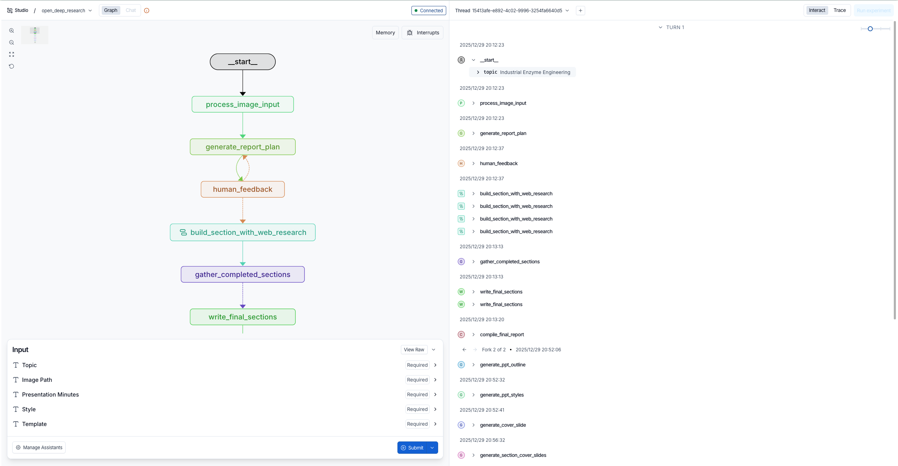

# Design First, Code Later: Aesthetically Pleasing Template-Free Slides Generation

> ACL 2026 Findings — Official Implementation (**DeepSlides**)

**DeepSlides** is an AI-powered presentation generation system that takes a topic (and optional image or style spec) and produces a fully formatted `.pptx` file. It extends the [Open Deep Research](https://github.com/langchain-ai/open_deep_research) architecture with a multi-stage pipeline for research, content writing, slide planning, and automated visual design.

[中文文档](README_zh.md)

---

## How it works

DeepSlides follows a graph-based plan-and-execute workflow implemented in `src/open_deep_research/graph.py`:

```
Input (topic / image / style)
  │
  ▼
[Image Analysis]       ← optional: understand research intent from an image
  │
  ▼
[Report Planning]      ← planner LLM outlines sections and search queries
  │
  ▼
[Research & Writing]   ← parallel: web search + section writing per topic
  │
  ▼
[PPT Planning]         ← allocate slides per section, generate slide outlines
  │
  ▼
[Slide Generation]     ← parallel per slide: enrich content → design layout → render PPTX
  │
  ▼
[Scoring & Refinement] ← LLM scores design, aesthetics, completeness; retries if needed
  │
  ▼
[Cover / Chapter / End slides]
  │
  ▼
Output: presentation.pptx  (+ optional PNG export via LibreOffice)
```

---

## Key features

- **End-to-end automation** — input a topic string and get a `.pptx` back, no manual editing required.
- **Multi-model support** — configure separate LLMs for the planner, writer, coder, and designer roles. Works with OpenAI, Azure OpenAI, Anthropic Claude, and any OpenAI-compatible endpoint.
- **Multi-search backend** — Tavily, Perplexity, Exa, DuckDuckGo, arXiv, PubMed, Google Search, LinkUp.
- **Image input** — provide a figure or screenshot; the system analyses it with a vision model to infer the research direction.
- **Style control** — pass a style description, color palette, or template path; the designer model applies it consistently across all slides.
- **LLM-based scoring** — each slide is scored on design, aesthetics, and completeness; low-scoring slides are regenerated automatically.
- **Automatic cover / chapter / end slides** — dedicated LLM calls generate these framing slides with matched styling.
- **Parallel execution** — slides within a section are generated concurrently via LangGraph's `Send()` API.

---

## Key files

| File | Purpose |
|---|---|
| `src/open_deep_research/graph.py` | Main workflow graph (all nodes and edges) |
| `src/open_deep_research/configuration.py` | All configurable parameters and defaults |
| `src/open_deep_research/prompts.py` | Prompt templates for every stage |
| `src/open_deep_research/state.py` | TypedDict / Pydantic state schemas |
| `src/open_deep_research/utils.py` | Search backends, image captioning helpers |
| `src/open_deep_research/run.py` | Batch runner (CSV input) |

---

## Quick start

### 1. Clone and install

```bash
git clone <your-repo-url>
cd multimodal_open_deep_research

python -m venv .venv
source .venv/bin/activate   # Windows: .venv\Scripts\activate
pip install -e .
```

If you use the local `pptx_tools` helper package (recommended for PPT rendering):

```bash
cd pptx_tools && pip install -e . && cd -
```

### 2. Configure environment variables

Copy the example env file and fill in your keys:

```bash
cp .env.example .env
```

Minimum required variables:

```dotenv
# LLM provider
OPENAI_API_KEY=sk-...
OPENAI_API_BASE=https://api.openai.com/v1   # or your proxy / Azure endpoint

# Search (pick at least one)
TAVILY_API_KEY=tvly-...

# Optional: separate key/endpoint for the designer model
DESIGNER_API_BASE=https://...
```

Other supported variables: `AZURE_OPENAI_API_VERSION`, `AZURE_OPENAI_DEPLOYMENT`, `CODER_API_BASE`, `EXA_API_KEY`, `GOOGLE_API_KEY`, `GOOGLE_CX`, `LANGCHAIN_API_KEY`.

### 3. Run

**Option A — LangGraph dev server (interactive UI)**

```bash
langgraph dev --no-reload
```

This starts the LangGraph Studio UI at `http://localhost:8123`. You can submit inputs, inspect graph state, and replay individual nodes interactively.



The left panel shows the live workflow graph; the right panel shows the execution log per node. Fill in **Topic**, **Presentation Minutes**, **Style**, etc. in the bottom input form and click **Submit**.

**Option B — Batch runner (CSV input)**

```bash
python src/open_deep_research/run.py
```

Edit the `csv_path`, `start`, and `max_rows` arguments inside `run.py` to point at your input file. The CSV must have at minimum a `Topic` column. Optional columns: `image_path`, `style`, `presentation_minutes`.

---

## Configuration reference

All parameters live in `Configuration` (`configuration.py`). Key fields:

| Parameter | Default | Description |
|---|---|---|
| `planner_model` | `openai/gpt-4o-mini-2024-07-18` | Model for report outline generation |
| `writer_model` | `openai/gpt-4o-mini-2024-07-18` | Model for section content writing |
| `coder_model` | `anthropic/claude-haiku-4.5` | Model for PPTX code generation |
| `designer_model` | `anthropic/claude-haiku-4.5` | Model for slide layout design |
| `search_api` | `tavily` | Search backend (`tavily`, `exa`, `duckduckgo`, `arxiv`, `pubmed`, `googlesearch`, `perplexity`, `linkup`) |
| `max_search_depth` | `5` | Max reflection + search iterations per section |
| `number_of_queries` | `2` | Search queries per section |
| `number_of_queries_for_ppt` | `1` | Additional search queries during slide enrichment |

Override any field by passing it in the `configurable` dict:

```python
from langchain_core.runnables import RunnableConfig

config = RunnableConfig(configurable={
    "planner_model": "openai/gpt-4o",
    "search_api": "exa",
    "max_search_depth": 3,
})
result = asyncio.run(graph.ainvoke(state, config=config))
```

---

## Dependencies

Core dependencies (see `pyproject.toml` for the full list):

- `langgraph` — graph execution engine
- `langchain-openai`, `langchain-anthropic` — LLM integrations
- `python-pptx` — PPTX rendering (via `pptx_tools`)
- `tavily-python`, `exa-py`, `duckduckgo-search`, `linkup-sdk` — search backends
- `google-cloud-vision` — optional vision API for image captioning
- `langsmith` — optional tracing

Optional system dependency for PNG export:

```bash
# macOS
brew install libreoffice
# Ubuntu
sudo apt install libreoffice
```

---

## Notes on privacy

- **Never commit your `.env` file.** It is listed in `.gitignore` by default.
- All API keys are read exclusively from environment variables — no keys are hardcoded in the source.
- The `ABLATE_DESIGN` and `ABLATE_SCORING` env vars can disable the scoring/refinement passes for ablation experiments.

---

## License

MIT

---

## Citation

If you find this work useful, please cite our paper:

```bibtex
@inproceedings{cui2026design,
  title     = {Design First, Code Later: Aesthetically Pleasing Template-Free Slides Generation},
  author    = {Cui, Zhiyao and Wang, Chenxu and Hu, Shuyue and Zhang, Yiqun and Shao, Wenqi and Zhang, Qiaosheng and Wang, Zhen},
  booktitle = {Findings of the Association for Computational Linguistics: ACL 2026},
  year      = {2026}
}
```
